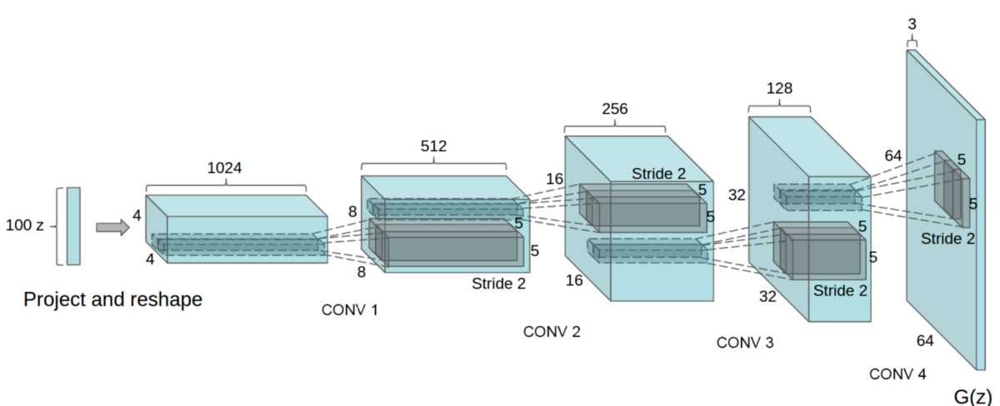
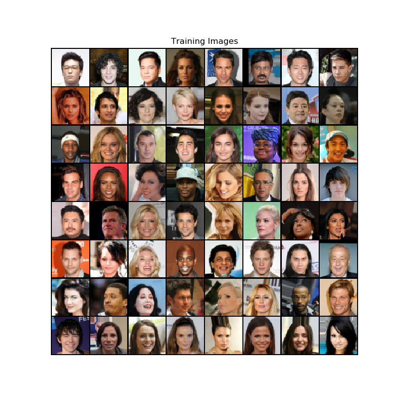
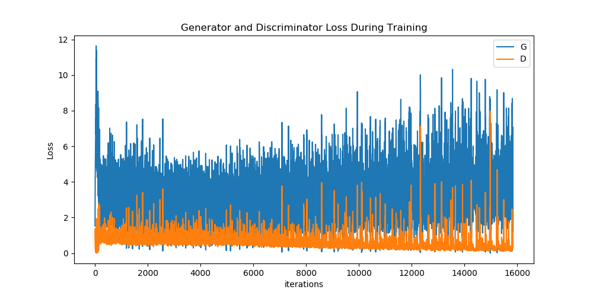
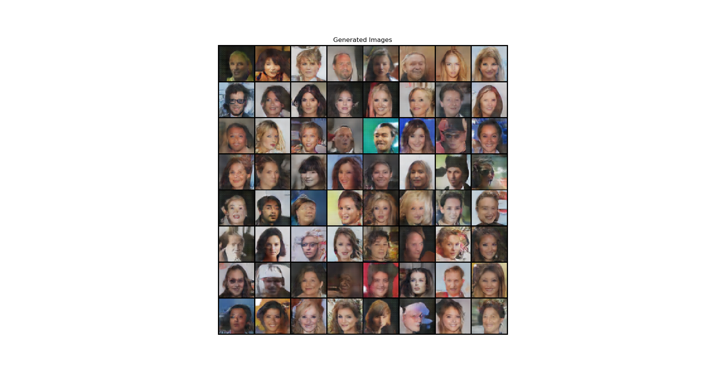

# Deep Convolutional GAN

PyTorch implementation of DCGAN introduced in the paper: [Unsupervised Representation Learning with Deep Convolutional 
Generative Adversarial Networks](https://arxiv.org/abs/1511.06434), Alec Radford, Luke Metz, Soumith Chintala.

<p align="center">

</p>

## Introduction
Generative Adversarial Networks (GANs) are one of the most popular (and coolest)
Machine Learning algorithms developed in recent times. They belong to a set of algorithms called generative models, which
are widely used for unupervised learning tasks which aim to learn the uderlying structure of the given data. As the name
suggests GANs allow you to generate new unseen data that mimic the actual given real data. However, GANs pose problems in
training and require carefullly tuned hyperparameters.This paper aims to solve this problem.

DCGAN is one of the most popular and succesful network design for GAN. It mainly composes of convolution layers 
without max pooling or fully connected layers. It uses strided convolutions and transposed convolutions 
for the downsampling and the upsampling respectively.

**Generator architecture of DCGAN**
<p align="center">

</p>

**Network Design of DCGAN:**
* Replace all pooling layers with strided convolutions.
* Remove all fully connected layers.
* Use transposed convolutions for upsampling.
* Use Batch Normalization after every layer except after the output layer of the generator and the input layer of the discriminator.
* Use ReLU non-linearity for each layer in the generator except for output layer use tanh.
* Use Leaky-ReLU non-linearity for each layer of the disciminator excpet for output layer use sigmoid.

## Hyperparameters for this Implementation
Hyperparameters are chosen as given in the paper.
* mini-batch size: 128
* learning rate: 0.0002
* momentum term beta1: 0.5
* slope of leak of LeakyReLU: 0.2
* For the optimizer Adam (with beta2 = 0.999) has been used instead of SGD as described in the paper.

## Data
This implementation uses the [CelebA](http://mmlab.ie.cuhk.edu.hk/projects/CelebA.html) dataset. However, any other dataset can
also be used. Download the data and update the directory location inside the `root` variable in **`utils.py`**.

**CelebA Dataset**
<p align="center">

</p>

## Training
To train the model, run **`train.py`**. To set the training parametrs, update the values in the `params` dictionary in `train.py`.
Checkpoints would be saved by default in model directory every 2 epochs. 
By default, GPU is used for training if available.

*Training will take a long time. It took me around 3 hours on a NVIDIA GeForce GTX 1060 GPU. Using a CPU is not recommended.*

**Loss Curves**
<p align="center">

</p>
<i>D: Discriminator, G: Generator</i>

## Generating New Images
To generate new unseen images, run **`generate.py`**.
```sh
python3 generate.py --load_path /path/to/pth/checkpoint --num_output n
```
**Generated Images**
<p align="center">
  <i>After Epoch 1:</i> 
  <i>After Epoch 10:</i> 
</p>

## References
1. **Alec Radford, Luke Metz, Soumith Chintala.** *Unsupervised representation learning with deep convolutional 
generative adversarial networks.*[[arxiv](https://arxiv.org/abs/1511.06434)]
2. **Ian Goodfellow, Jean Pouget-Abadie, Mehdi Mirza, Bing Xu, David Warde-Farley, 
Sherjil Ozair, Aaron Courville, Yoshua Bengio.** *Generative adversarial nets.* NIPS 2014 [[arxiv](https://arxiv.org/abs/1406.2661)]
3. **Ian Goodfellow.** *Tutorial: Generative Adversarial Networks.* NIPS 2016 [[arxiv](https://arxiv.org/abs/1701.00160)]
4. DCGAN Tutorial. [https://pytorch.org/tutorials/beginner/dcgan_faces_tutorial.html]
5. PyTorch Docs. [https://pytorch.org/docs/stable/index.html]
